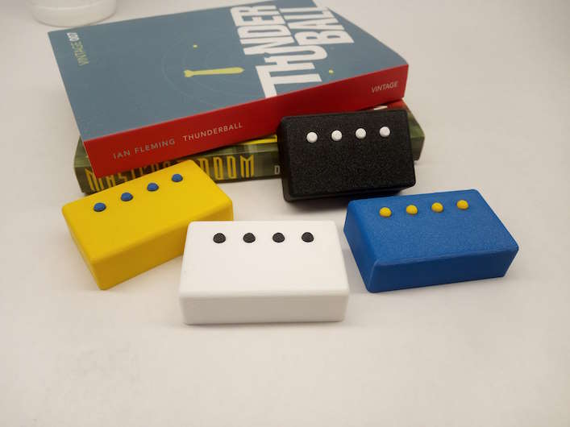

# Agora BLE buttons (blitch)
  
Firmware for Bluetooth buttons with BThome protocol. Works with Home Assistant.

## Harware
https://github.com/dadantech/blitch-hardware

## 3D models
https://www.thingiverse.com/thing:6855799

## Shop
It is for sale on Tindie: https://www.tindie.com/products/dadantech/agora-ble-buttons/

# Data format
https://bthome.io/format/

# Battery
AAA alkaline/ NiMH  cca 1000 mAh
* over 1,2 V - 100 %
* under 1 V - 0%
CR2032 cca 235 mAh
* 3V - 100%
* 2.2 V - 0%

# Average consumption 
* 500 ms advertisment: 25 uA -> @ 1000 mAh 4.4 years

